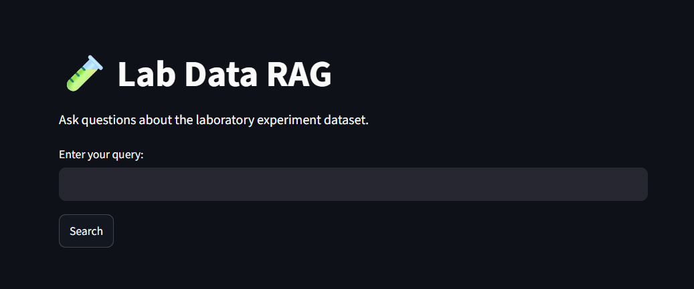
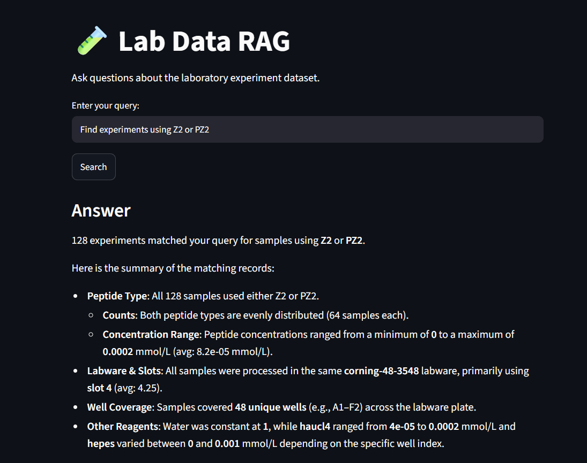

# Lab Data Pipeline RAG

A Streamlit-based question-answering application for laboratory experiment data. It transforms raw CSV records into a searchable SQLite dataset, creates cached local embeddings, converts natural-language questions into structured metadata filters, and generates concise answers from the matching experiments. The workflow uses Ollama's `nomic-embed-text` model for embeddings, `qwen3:1.7b` for query parsing, and `qwen3.5:4b` for answer generation.

## Overview

This repository combines:

- a small ETL pipeline for CSV processing
- SQLite-based sample storage and lookup
- retrieval helpers that convert database rows into text documents
- cached local embeddings using the `nomic-embed-text` embedding model
- natural-language query parsing with `qwen3:1.7b`
- answer generation with `qwen3.5:4b` using filtered experiment records
- a Streamlit interface for interactive questions

## Prerequisites

- Python 3.10+
- Ollama installed and running locally
- Access to the data files in the repository

## Setup

### 1) Create and activate a virtual environment

From the project root:

```bash
python -m venv .venv
```

Windows PowerShell:

```powershell
.\.venv\Scripts\Activate.ps1
```

Windows Command Prompt:

```cmd
.venv\Scripts\activate.bat
```

macOS/Linux:

```bash
source .venv/bin/activate
```

### 2) Install dependencies

```bash
pip install -r requirements.txt
```

### 3) Start Ollama and pull the models

This project uses Ollama for two model-powered stages:

- `qwen3:1.7b` for natural-language query parsing
- `qwen3.5:4b` for answer generation
- `nomic-embed-text` for document embeddings

```bash
ollama pull qwen3.5:4b
ollama pull qwen3:1.7b
ollama pull nomic-embed-text
```

If Ollama is not installed, download it from:

https://ollama.com/download

## Streamlit application

The main application is implemented in `app.py`. Enter a natural-language question about the laboratory experiments and select **Search** to run the RAG workflow.

From the project root, start the application with:

```bash
streamlit run app.py
```

The application:

1. Loads sample records from SQLite.
2. Converts the records into text documents with metadata.
3. Loads cached embeddings, or creates and saves them if the cache does not exist.
4. Converts the question into structured filters with `qwen3:1.7b`.
5. Filters embedded documents using the returned metadata filters.
6. Generates an answer with `qwen3.5:4b` from the matching experiment records.

After Streamlit starts, open `http://localhost:8501` in a browser.

## Screenshots

### User interface



### Search results



## Data pipeline

The raw dataset is read from:

- `data/raw/4x4x4_SI.csv`

The ETL step cleans and normalizes the data and writes the processed output to:

- `data/processed/lab_data_clean.csv`

The cleaning logic lives in `src/etl.py` and includes:

- column name normalization
- duplicate removal
- numeric coercion
- whitespace cleanup
- validation for required UID values

To run the data processing step:

```bash
python src/etl.py
```

## Database setup

The project stores sample records in SQLite.

The seed script creates the database table from the processed CSV:

```bash
python database/seed.py
```

This creates `database/lab.db` using the data in `data/processed/lab_data_clean.csv`.

The database connection and SQLite row handling are defined in `src/database.py`.

## Query and retrieval modules

The project includes query helpers in `src/queries.py`:

- `get_sample_by_uid(uid)`
- `get_samples_by_peptide(peptide)`
- `get_samples_by_well(wellcode)`
- `get_peptide_counts()`
- `get_all_samples()`

The retrieval layer in `src/retrieval.py` wraps these queries and converts rows into structured dictionaries or text documents.

### Example

```bash
python -m src.test_queries
python -m src.test_retrieval
```

## Embeddings and filtering

`src/document.py` converts sample records into documents containing the source metadata and text used for embedding. `src/embeddings.py` provides:

- `create_embedding(text)` for one Ollama embedding
- `create_embeddings(documents)` for a document collection
- `save_embeddings(documents, filepath)` and `load_embeddings(filepath)` for pickle storage
- `get_embeddings(documents)` to load the default cache or create it from source documents when it does not exist
- `filter_embedded_documents(documents, filters)` for metadata filtering

Embedded documents have this shape:

```python
{
	"uid": "...",
	"metadata": {
		"peptide": "...",
		"peptide_name": "...",
		"water": 0.0,
		"haucl4": 0.0,
		"hepes": 0.0,
		"slot": 0,
		"labwaretype": "...",
		"wellcode": "...",
		"wellindex": 0
	},
	"text": "...",
	"embedding": []
}
```

The default cache is stored at `data/embeddings/nomic_embed_text_embeddings.pkl`. The cache is loaded when it exists; otherwise `get_embeddings(documents)` creates embeddings through Ollama and saves them. To build a separate embedding file explicitly:

```bash
python -m src.build_embeddings
```

The filter fields are `uid`, `peptide`, `peptide_name`, `water`, `haucl4`, `hepes`, `slot`, `labwaretype`, `wellcode`, and `wellindex`. Supported operators are `=`, `!=`, `<`, `>`, `<=`, `>=`, `IN`, and `NOT IN`.

To run the embedding and filter checks against the existing pickle:

```bash
python -m src.test_filter_embedded_documents_embeddings
```

## Natural-language RAG workflow

`src/query_parser.py` uses `qwen3:1.7b` to convert a natural-language question into validated structured filters. `src/answer_generator.py` summarizes the matching records and uses `qwen3.5:4b` to produce a concise answer using only that summary and sample records.

Run the interactive workflow with:

```bash
python -m src.test_answer_generator
```

The query parser can also be tested independently:

```bash
python -m src.test_query_parser
```

Both scripts load the existing default embedding file through `get_embeddings(...)`. If the default cache is missing, source documents must be supplied so embeddings can be created and saved.

For direct vector similarity search, use `src/search.py` and its example script:

```bash
python -m src.test_search
```


## Project structure

```text
lab-data-pipeline-rag/
├── app.py
├── Readme.md
├── requirements.txt
├── sources.txt
├── data/
│   ├── embeddings/
│   ├── raw/
│   └── processed/
├── database/
│   ├── seed.py
│   └── select.py
├── src/
│   ├── __init__.py
│   ├── database.py
│   ├── document.py
│   ├── etl.py
│   ├── build_embeddings.py
│   ├── embeddings.py
│   ├── answer_generator.py
│   ├── queries.py
│   ├── query_parser.py
│   ├── retrieval.py
│   ├── search.py
│   ├── test_answer_generator.py
│   ├── test_document.py
│   ├── test_embeddings.py
│   ├── test_filter_embedded_documents_embeddings.py
│   ├── test_query_parser.py
│   ├── test_queries.py
│   ├── test_retrieval.py
│   └── test_search.py
└── .venv/   # local virtual environment
```
